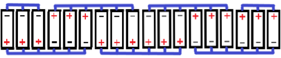

# Documentazione Battery Pack per Drone Sottomarino (Configurazione Cilindrica per Alloggiamento Impermeabile)

Questo documento descrive le specifiche e la configurazione del battery pack progettato per alimentare il drone sottomarino, ottimizzato per un alloggiamento di forma cilindrica all'interno di un tubo in plexiglass impermeabile.

## Specifiche delle Celle

* **Modello:** 18650
* **Voltaggio Nominale:** 3.7V per cella
* **Capacità:** 2500mAh per cella

[Datasheet](datasheet/celle_litio.pdf)

## Sufficienza per l'Alimentazione del Drone Sottomarino (Motori a 24v)

La scelta di queste 18 celle, combinate nella configurazione descritta di seguito, fornisce l'energia necessaria al funzionamento dei motori a 24v del drone sottomarino all'interno di un alloggiamento cilindrico impermeabile (tipicamente un tubo in plexiglass per garantire l'isolamento dall'acqua). La capacità totale utilizzabile del pacco batteria garantisce un'autonomia adeguata per le operazioni subacquee, mentre il voltaggio nominale di circa 24.2V è compatibile con i motori a 24v (rientrando nelle tolleranze operative tipiche).

## Scheda di Protezione della Batteria 6S 22.2V 40A

L'utilizzo di una **Scheda di Protezione della Batteria (BMS) 6S 24.2V 40A con bilanciamento della carica** è cruciale per garantire la sicurezza e la longevità del pacco batteria all'interno dell'ambiente sigillato. Questa BMS è specificamente progettata per gestire pacchi batteria con sei gruppi principali collegati in serie, fornendo la tensione nominale di circa 24.2V necessaria per alimentare i motori a 24V. La BMS monitora e bilancia la carica e la scarica di ciascun gruppo, proteggendo le celle da sovraccarico, scarica eccessiva e cortocircuiti, elementi critici in un sistema sigillato.

[Datasheet](datasheet/Scheda_protezione_celle.pdf)

## Disposizione delle Celle (Serie e Parallelo per Alloggiamento Cilindrico)

Le 18 celle sono disposte in tre blocchi, con ogni blocco costituito da sei celle disposte in parallelo. Ogni blocco è poi collegato in serie con gli altri per formare una configurazione 6S3P. La disposizione è la seguente:

* **Blocco 1:** 6 celle in parallelo
* **Blocco 2:** 6 celle in parallelo
* **Blocco 3:** 6 celle in parallelo

Questi blocchi sono collegati in serie per formare il pacco batteria 6S3P, gestito dalla BMS, che fornisce il voltaggio necessario per i motori e tutta la struttura:

* **Blocco 1 (Serie 1 della BMS):** 6 celle in parallelo
* **Blocco 2 (Serie 2 della BMS):** 6 celle in parallelo
* **Blocco 3 (Serie 3 della BMS):** 6 celle in parallelo

## Caratteristiche del Pacco Batteria all'interno del Tubo in Plexiglass

* **Voltaggio Nominale Totale:** Circa 24.2V (6 celle in serie, ognuna con un voltaggio nominale di 3.7V), compatibile con i motori a 24V.
* **Capacità Totale Utilizzabile:** 7500mAh (limitata dal gruppo con la capacità inferiore, derivato dai gruppi con 6 celle in parallelo). La capacità garantisce un'operatività prolungata per le missioni subacquee.

## Considerazioni sulla Disposizione e sull'Alloggiamento Impermeabile

La disposizione delle celle in parallelo tra i blocchi è stata progettata per adattarsi alla geometria interna del tubo in plexiglass, garantendo al contempo un fissaggio sicuro e la protezione delle celle dall'ambiente acquatico. L'alloggiamento in plexiglass fornisce un isolamento elettrico essenziale e protegge il pacco batteria dalla pressione dell'acqua. La BMS 6S, alloggiata anch'essa all'interno del tubo impermeabile, è vitale per la gestione sicura ed efficiente dell'energia fornita ai motori, bilanciando le tensioni e prevenendo condizioni operative pericolose all'interno del sistema sigillato.

## Modello realizzato

