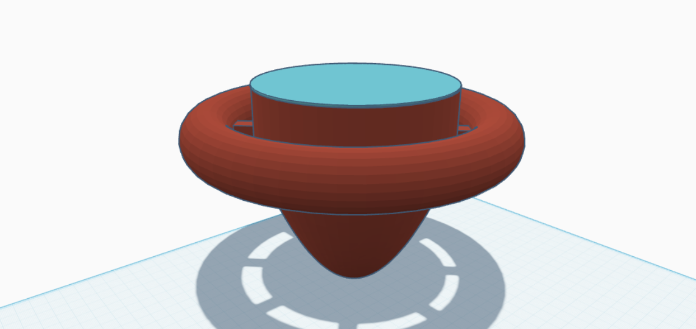

# 🛟 Modello 3D - Boa di Superficie

## 📦 Descrizione del Modello

La boa è stata progettata con una struttura conica tripartita per ottimizzare galleggiamento e stabilità:

### 🏗️ Struttura a Zone

1. **Zona Superiore** (Area Elettronica):
   - Alloggiamento stagno per Raspberry Pi 5
   - Disponibilità di alloggiamento del modulo GPS in posizione elevata (non attuato a causa del regolamento)
   - Predisposto per antenna WiFi usabile per la comunicazione (non attuata a causa del regolamento)
   - Vano ventilato per dissipazione calore

2. **Zona Centrale** (Camera d'Aria):
   - Camera stagna riempita d'aria
   - Design conico per ottimizzare il galleggiamento
   - Punti di ancoraggio per cavi sottomarini
   - Struttura rinforzata per resistenza onde

3. **Zona Inferiore** (Zavorra):
   - Compartimento riempibile con sabbia
   - Sistema di bilanciamento peso
   - Agganci per cavi ethernet e USB
   - Base stabilizzatrice

## 🛠️ Specifiche Tecniche

- **Materiale**: PETG resistente acqua salata
- **Dimensioni**: 50cm altezza, 30cm diametro base
- **Impermeabilità**: IP68 zona elettronica
- **Galleggiabilità**: Regolabile tramite zavorra

## ⚡ Caratteristiche Principali

- Design modulare per facile manutenzione
- Sistema di raffreddamento passivo
- Guarnizioni marine certificate
- Passacavi stagni certificati IP68
- Punti di aggancio rinforzati

## 🖼️ Anteprima del Modello

## 📁 File CAD Disponibili

I file STL e OBJ del modello sono disponibili nella cartella:
- [`/file_3D`](file_3D/boa.stl)

---

[torna alla home](../../../README.md)
