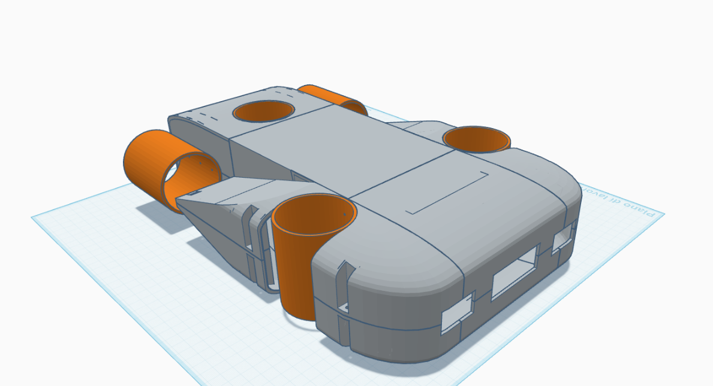

# 🌊 Modello 3D - Sottomarino

## 📦 Descrizione del Modello

Il modello 3D del sottomarino è stato progettato per ospitare al suo interno un **cilindro in plexiglass** a tenuta stagna. Questo componente svolge una funzione fondamentale: **proteggere tutta l’elettronica sensibile** (Raspberry Pi, Arduino, batterie, schede elettroniche, ecc.) dall’ambiente esterno, impedendo l’ingresso dell’acqua.

La struttura esterna funge da scafo idrodinamico e supporto meccanico, mentre le uniche componenti a diretto contatto con l’acqua sono:
- **Motori** (per la propulsione e il movimento),
- **Sensori subacquei** (come temperatura, pressione, salinità),
- **Cavi stagni**, appositamente sigillati per collegare i dispositivi esterni al modulo interno.

---

## 🧩 Caratteristiche del Design

- **Materiale stampabile**: PLA+ o PETG per la parte esterna, consigliato uso di O-ring e guarnizioni in silicone per i punti critici.
- **Modulo interno**: Cilindro in plexiglass trasparente con tappi filettati e guarnizioni per l’accesso rapido all’elettronica.
- **Canaline passacavi**: Incorporate nel modello per mantenere l'ordine e l’impermeabilità dei collegamenti.
- **Alloggiamento motori**: Predisposto per motori brushless waterproof, montabili su supporti M3.
- **Struttura modulare in 6 parti**: Il modello è stato **suddiviso in 6 segmenti** per adattarsi al volume di stampa delle stampanti FDM domestiche.

---

## ⚠️ Vantaggi della Struttura Interna

Utilizzare un cilindro di plexiglass per contenere l’elettronica:
- Riduce il rischio di cortocircuiti dovuti all’umidità o infiltrazioni d'acqua,
- Migliora la **manutenibilità**: l’elettronica può essere estratta velocemente dal corpo principale,
- Permette l’uso di componenti **non waterproof** grazie all’isolamento fisico,
- Agevola la dissipazione del calore tramite contatto con il corpo in plexiglass.

---

## 🖼️ Anteprima del Modello

---

## 📁 File CAD Disponibili

I file STL e STEP del modello sono disponibili nella cartella:
- [`/file_3D`](../../file_3D)

---

